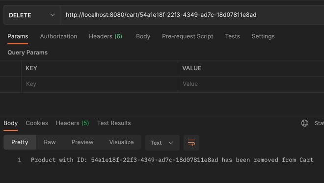
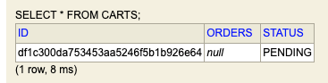
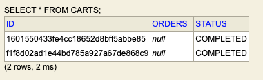
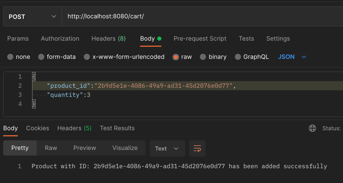
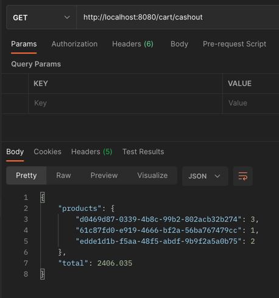
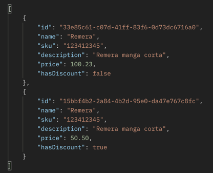
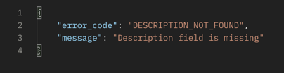
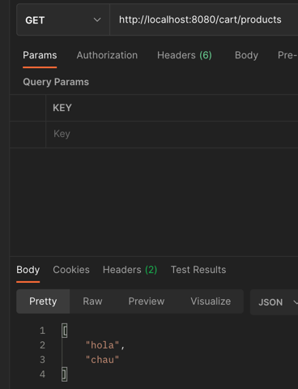

# CHANGELOG

This file will show the step by step of the commits since project's creation

## 18/01/2022 12:30 - Branch: feature/requests-cart
- Remove product from cart

## 18/01/2022 12:00 - Branch: feature/cart-repository
- Update CART status to completed when Cashout

## 18/01/2022 11:00 - Branch: feature/orders
- Save orders when added to cart
- Cashout development

## 17/01/2022 20:00 - Branch: feature/put-mapping
- PUT mapping development

  
## 17/01/2022 20:00 - Branch: feature/delete-item
- Delete mapping development

## 17/01/2022 17:30 - Branch: feature/services
- Validations and global exception handler

## 17/01/2022 15:40 - Branch: feathre/h2-database
- H2 database to use as a repository of products and carts.
  
## 17/01/2022 13:40 - Branch: feature/controller_first_approach
- Adding cart controller and products controller
  
## 17/01/2022 13:00 - Branch: feature/controller_first_approach
- Controller first approach

## 17/01/2022 12:00
- First commit with project's structure